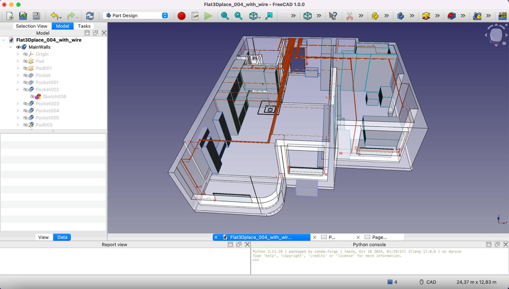
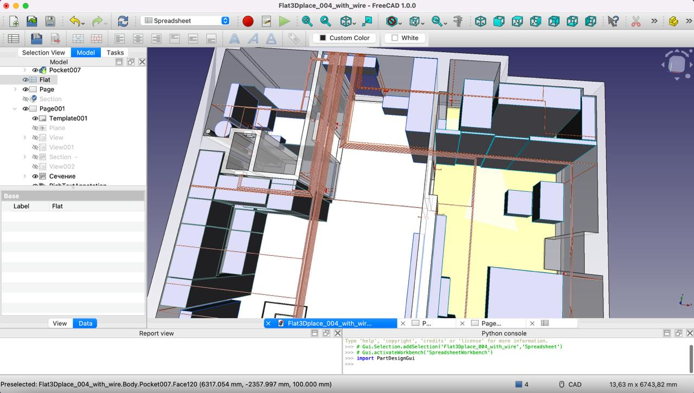
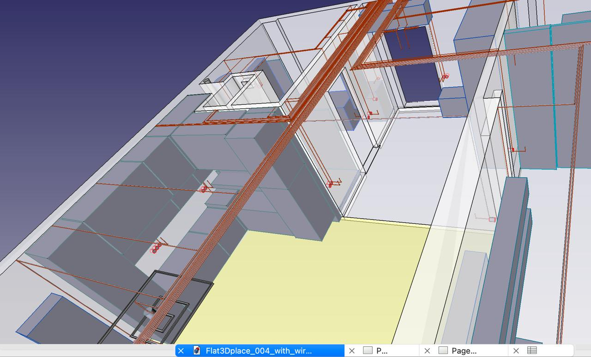
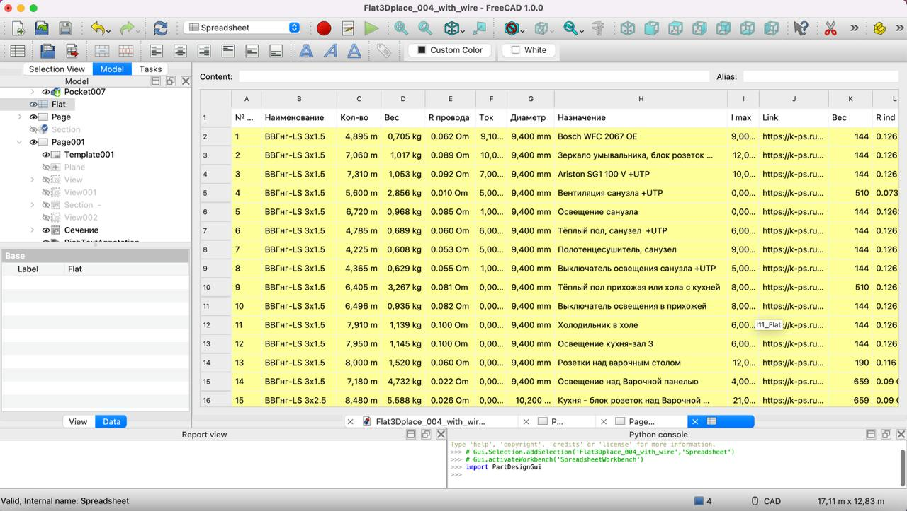
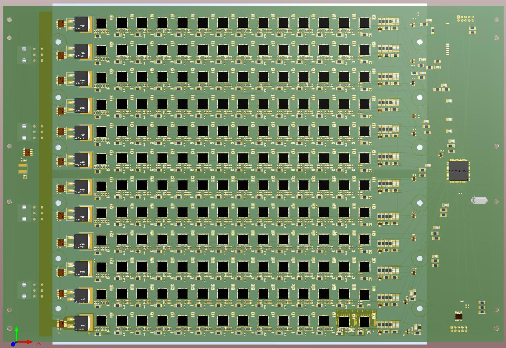
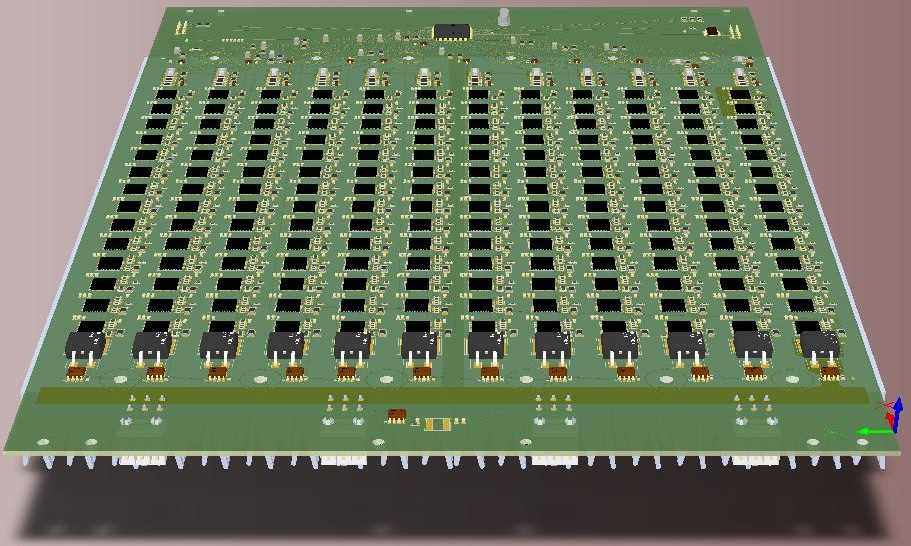
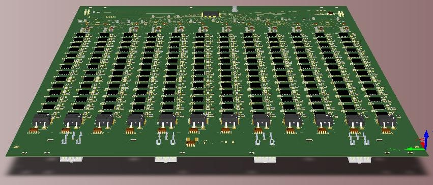
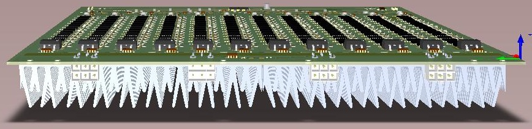
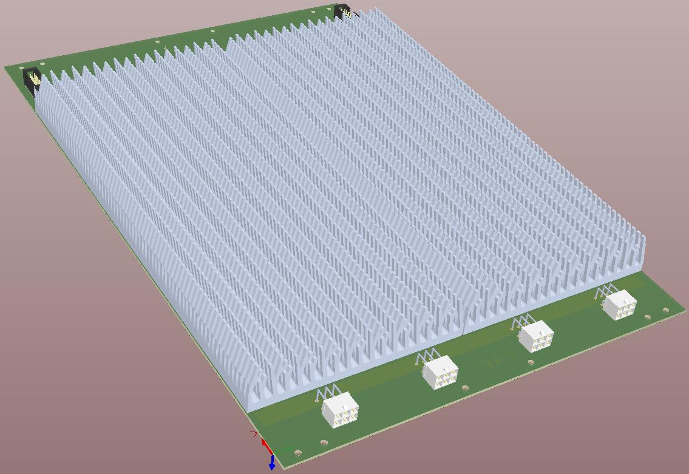
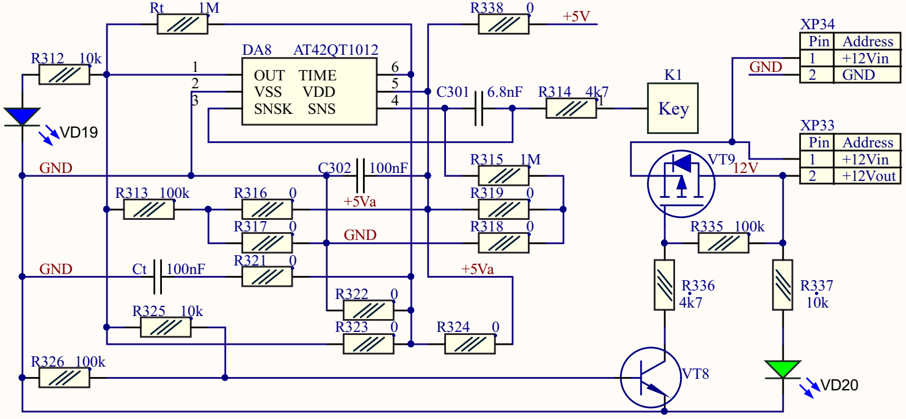

# ProjectCollection

**[English](README.md)** | **[Русский](README.RU.md)** | **[Українська](README.UA.md)** | **[Português](README.PT.md)** | **[Français](README.FR.md)** | **[Deutsch](README.DE.md)**

---

План квартири, намальований у FreeCAD, на якому за допомогою Python-скрипта було прокладено електропроводку для розеток, вимикачів, світильників та іншого обладнання. За цією схемою було закуплено та прокладено проводку; розбіжність з розрахунковою специфікацією склала менше 5%.

## FreeCAD — Проводка в квартирі

<table>
<tr>
<td align="center" width="220">

</td>
<td valign="middle">
<h4>3D-модель квартири</h4>
Тривимірна модель квартири з електропроводкою, відображеною коричневим кольором.
</td>
</tr>
<tr>
<td valign="middle">
<h4>Вигляд зверху на проводку</h4>
План-вигляд з прокладкою всіх ліній проводки для розеток, вимикачів та світильників.
</td>
<td align="center" width="220">

</td>
</tr>
<tr>
<td align="center" width="220">

</td>
<td valign="middle">
<h4>Перспективний вигляд проводки</h4>
Перспективний вигляд, що показує тривимірне розташування всієї проводки.
</td>
</tr>
<tr>
<td valign="middle">
<h4>Таблиця специфікації проводів</h4>
Скрипт одночасно з прокладанням проводки згенерував повну таблицю специфікації проводів.
</td>
<td align="center" width="220">

</td>
</tr>
</table>

## Altium — Плати з ASIC

<table>
<tr>
<td align="center" width="220">

</td>
<td valign="middle">
<h4>Плата з ASIC — вигляд зверху</h4>
Друкована плата з обчислювальними чіпами ASIC, створена в Altium Designer, вигляд зверху.
</td>
</tr>
<tr>
<td valign="middle">
<h4>Плата з ASIC — перспективний вигляд</h4>
Друкована плата з обчислювальними чіпами ASIC, створена в Altium Designer, перспективний вигляд.
</td>
<td align="center" width="220">

</td>
</tr>
<tr>
<td align="center" width="220">

</td>
<td valign="middle">
<h4>Плата з ASIC — перспективний вигляд (детально)</h4>
Детальний перспективний вигляд плати з обчислювальними чіпами ASIC.
</td>
</tr>
<tr>
<td valign="middle">
<h4>Плата з ASIC — вид збоку з радіатором</h4>
Вигляд збоку на друковану плату з встановленим радіатором.
</td>
<td align="center" width="220">

</td>
</tr>
<tr>
<td align="center" width="220">

</td>
<td valign="middle">
<h4>Плата з ASIC — сторона радіатора</h4>
Вигляд на друковану плату з боку радіатора.
</td>
</tr>
</table>

## Altium — Принципові схеми

<table>
<tr>
<td align="center" width="220">

</td>
<td valign="middle">
<h4>Схема сенсорного вимикача</h4>
Принципова схема сенсорного вимикача, створена в Altium Designer.
</td>
</tr>
</table>

### Принципові схеми (PDF)

| Документ | Опис |
|---|---|
| [REG-007a.pdf](REG-007a.pdf) | Принципова схема контролера температури |
| [RelayExpan.PDF](RelayExpan.PDF) | Принципова схема розширявача керування реле для підключення навантажень |
| [STM32F427ITx.pdf](STM32F427ITx.pdf) | Принципова схема головного контролера квартири з інтерфейсом CAN |
| [USBHART2.pdf](USBHART2.pdf) | Принципова схема USB HART-модему |
| [WoterMake_2019-02-11_16-03.PDF](WoterMake_2019-02-11_16-03.PDF) | Принципова схема головного контролера водопідготовки з інтерфейсами RS485, CAN та Ethernet |
| [XMC1404KEY4c_with_note.PDF](XMC1404KEY4c_with_note.PDF) | Принципова схема розумного вимикача з інтерфейсом CAN |
